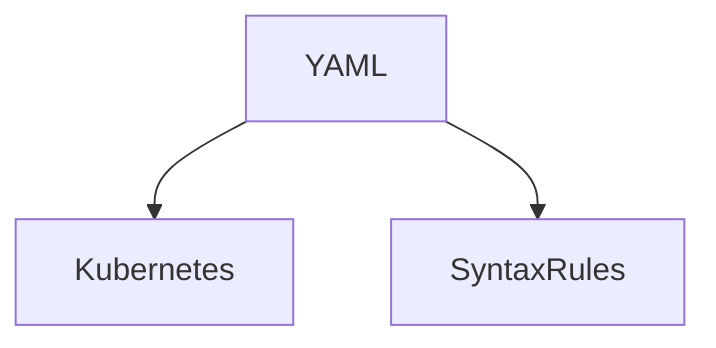
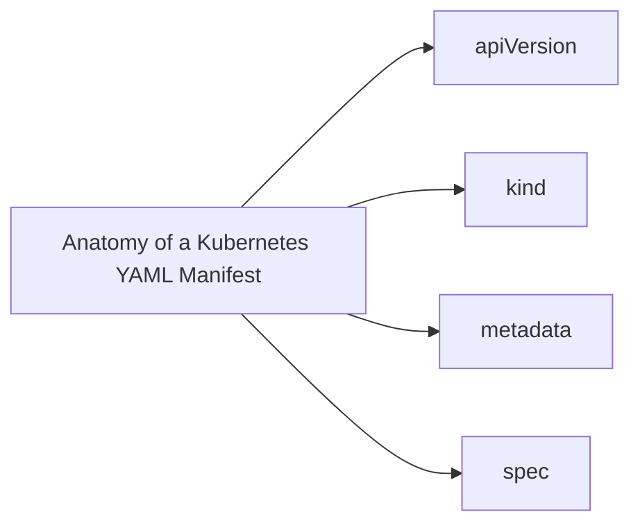

# 1. Introduction to YAML

YAML (YAML Ain't Markup Language) is a human-readable data serialization standard used for configuration files and in applications where data is being stored or transmitted. In Kubernetes, YAML manifests describe how to create, configure, and manage Kubernetes cluster components.

- **Basic Syntax Rules:**
    - Indentation is used to denote structure.
    - Lists are denoted with hyphens.
    - Key-value pairs are separated by colons.



# 2. Anatomy of a Kubernetes YAML Manifest

A Kubernetes YAML manifest contains several required fields that define the resource:

- **apiVersion:** Specifies the API version to use (e.g., `v1`, `apps/v1`).
- **kind:** The type of resource to create (e.g., Pod, Service, Deployment).
- **metadata:** Data that helps uniquely identify the object, including a `name` string, `labels`, and `annotations`.
- **spec:** Specifies the desired state of the object.



# 3. Writing a Simple Pod Manifest

Example of a simple Pod manifest that runs an nginx container:

```yaml
apiVersion: v1
kind: Pod
metadata:
  name: nginx-example
spec:
  containers:
  - name: nginx
    image: nginx:latest
```

# 4. Deployments and Services

Deployment and Service YAML examples demonstrate how to manage sets of replicated Pods and expose them as network services.

- **Deployment YAML Example:**
    - Manages a replicated application.
- **Service YAML Example:**
    - Provides a consistent IP address for accessing the replicated Pods.

# 5. Best Practices for Writing YAML Manifests

- **Readability:** Use consistent indentation and include comments for clarity.
- **Maintainability:** Leverage tools like Kustomize for parameterization and management of manifests.

# 6. Common Challenges and Troubleshooting

- **Common Errors:** Incorrect indentation, missing required fields, and misuse of data types.
- **Debugging:** Use tools like `kubectl apply --validate=true` to check for syntax errors before applying.

By understanding the structure and composition of YAML manifests, Kubernetes administrators and developers can define and manage resources in a Kubernetes cluster effectively. This section provides the foundational knowledge needed to work with Kubernetes resources, setting the stage for more advanced topics and hands-on practice.