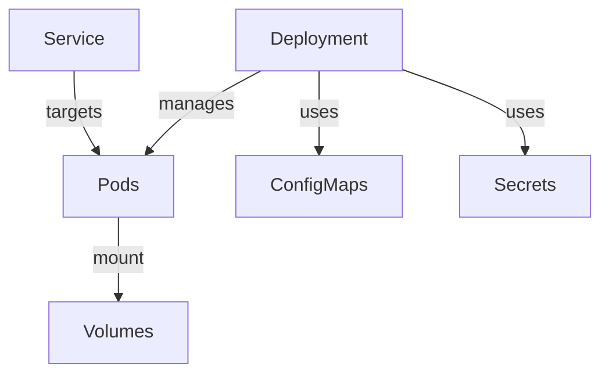
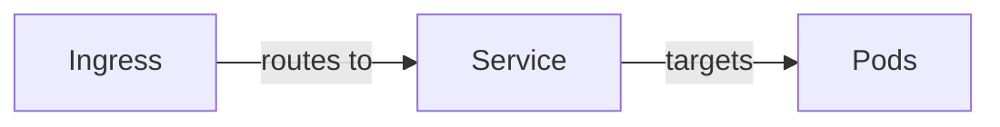

# Intro
In this "Deep Dive into Manifest Components" section, we'll explore the essential components of Kubernetes manifests in
more detail, focusing on the parts that often appear in Kubernetes YAML files. Understanding these components is crucial
for anyone looking to master Kubernetes, as it forms the backbone of how resources are defined, managed, and interact
within the cluster.

# 1. API Version

The `apiVersion` field specifies the version of the Kubernetes API you're using to create the object. It's crucial
because different versions of an object might support different features.

- **Core Group (v1):** For core components like Pods.
- **Named Groups:** For specific features like `apps/v1` for Deployments.

# 2. Kind

The `kind` field tells Kubernetes what type of resource you want to create. Resources can be Pods, Deployments,
Services, etc. Each serves different roles within the Kubernetes ecosystem.

# 3. Metadata

- **Name:** Unique identifier within a namespace.
- **Labels:** Key/value pairs that allow resources to be queried and selected.
- **Annotations:** Non-identifying information to annotate resources with additional details.

# 4. Spec and Status

- **Spec:** Defines the desired state of the object. It's where you set your configurations.
- **Status:** Reflects the current state of the object within the Kubernetes system.

# 5. Selectors and Labels

Selectors are queries that match certain labels and are used to determine which resources fall under the management of
others, like Services managing Pods.

# 6. Volumes

Volumes are components that allow for data to persist beyond the lifecycle of a single Pod, ensuring data durability and
state persistence.

# 7. ConfigMaps and Secrets

- **ConfigMaps:** Used to store non-confidential data in key-value pairs. Can be used to store configurations or as
  environmental variables.
- **Secrets:** Similar to ConfigMaps but designed to hold confidential data.

# 8. Networking

- **Services:** Define a logical set of Pods and a policy by which to access them.
- **Ingress:** Manages external access to the services within a cluster, typically HTTP.
- **Network Policies:** Specify how groups of pods are allowed to communicate with each other and other network
  endpoints.

---

Let's visualize some of these components using mermaid diagrams, starting with the relationship between Pods,
Deployments, and Services, which are fundamental to understanding Kubernetes resource management.

And here's a simple diagram showing how networking components like Services and Ingress interact:

Understanding these components and how they interact within a Kubernetes environment allows for more effective cluster
management and resource deployment. Each plays a crucial role in the Kubernetes ecosystem, contributing to the overall
functionality, scalability, and resilience of applications.