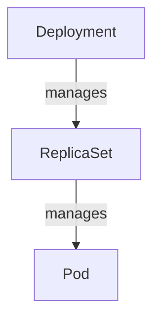

In the Kubernetes ecosystem, Pods, ReplicaSets, and Deployments represent foundational concepts that underpin how
applications are deployed, managed, and scaled. Understanding these components is crucial for effective Kubernetes
management. This section dives into each of these components, highlighting their purposes, relationships, and how they
contribute to a robust and resilient application deployment strategy.

# 1. Introduction to Pods

Pods are the smallest deployable units of computing that can be created and managed in Kubernetes. Each Pod is designed
to run a single instance of a given application, and it can contain one or more containers that are tightly coupled and
share resources.

- **Characteristics:**
    - Own IP addresses, storage, and configurations.
    - Containers in a Pod share the same network namespace.

# 2. Understanding ReplicaSets

A ReplicaSet's main purpose is to maintain a stable set of replica Pods running at any given time. It is used to
guarantee the availability of a specified number of identical Pods.

- **Features:**
    - Automatically replaces Pods that fail, are deleted, or are terminated.
    - Used for scaling applications by increasing or decreasing the number of replicas.

# 3. Exploring Deployments

Deployments provide declarative updates for Pods and ReplicaSets. You describe a desired state in a Deployment, and the
Deployment Controller changes the actual state to the desired state at a controlled rate.

- **Capabilities:**
    - Create new ReplicaSets, or remove existing Deployments and adopt all their resources with new Deployments.
    - Rollback to earlier Deployment revisions if the current state is not stable.
    - Scale up or down with ease to meet demand.

# 4. Relationship Among Pods, ReplicaSets, and Deployments

Deployments manage the lifecycle of Pods and ReplicaSets. A Deployment creates ReplicaSets that create Pods. This
layered approach allows for easy updates and scaling.

- **Flow:**
    - **Deployment** specifies the desired state.
    - **ReplicaSet** ensures the specified number of Pods are always running.
    - **Pods** are the runtimes where containers live.

# 5. Use Cases and Best Practices

- **Zero Downtime Deployments:** Using Deployments to create and manage ReplicaSets ensures no downtime during updates
  and rollbacks.
- **Scaling:** ReplicaSets can be manually scaled, or automatically scaled by Horizontal Pod Autoscalers, in response to
  demand.

Understanding how Pods, ReplicaSets, and Deployments interact provides a foundation for deploying and managing
applications on Kubernetes. These components ensure that applications are robust, scalable, and able to recover from
failure, thereby enhancing the resilience and flexibility of your Kubernetes cluster.