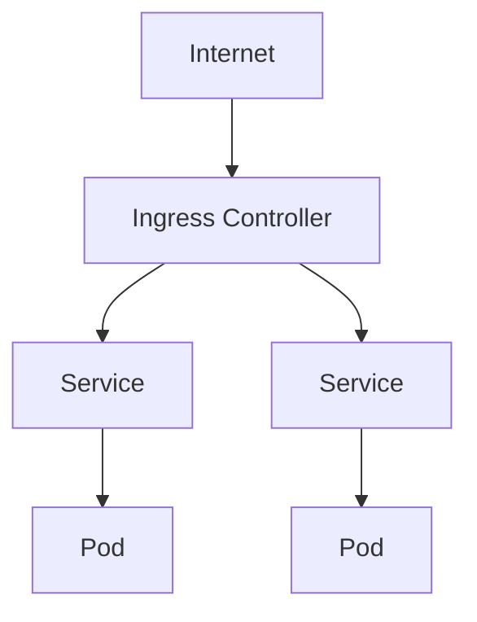

Let's delve deeper into the concepts of Services and Ingress in Kubernetes, emphasizing practical examples through
manifest configurations. This approach will not only explain the theoretical aspects but also demonstrate how these
components are defined and used in real Kubernetes environments to expose applications externally.

# 1. Introduction to Services

Services in Kubernetes abstract the way an application running on a set of Pods is exposed as a network service. They
allow your applications to receive traffic.

## Types of Services:

- **ClusterIP (default):** Exposes the service on an internal IP in the cluster, making the service only reachable
  within the cluster.
- **NodePort:** Exposes the service on each Node's IP at a static port.
- **LoadBalancer:** Exposes the service externally using a cloud provider’s load balancer.

## Example Manifest for ClusterIP Service

```yaml
apiVersion: v1
kind: Service
metadata:
  name: my-service
spec:
  selector:
    app: MyApp
  ports:
    - protocol: TCP
      port: 80
      targetPort: 9376
```

# 2. Understanding Ingress

Ingress exposes HTTP and HTTPS routes from outside the cluster to services within the cluster.

## Example Manifest for Basic Ingress

```yaml
apiVersion: networking.k8s.io/v1
kind: Ingress
metadata:
  name: minimal-ingress
spec:
  rules:
    - http:
        paths:
          - path: /
            pathType: Prefix
            backend:
              service:
                name: my-service
                port:
                  number: 80
```

# 3. Combining Services and Ingress

Services provide a way for Ingress to route traffic to Pods. This is essential for exposing your application externally.

## Example Configuration for a Web Application

1. **Service:**

```yaml
apiVersion: v1
kind: Service
metadata:
  name: web-service
spec:
  selector:
    app: web
  ports:
    - protocol: TCP
      port: 80
      targetPort: 8080
```

2. **Ingress:**

```yaml
apiVersion: networking.k8s.io/v1
kind: Ingress
metadata:
  name: web-ingress
spec:
  rules:
    - host: mywebsite.example.com
      http:
        paths:
          - path: /
            pathType: Prefix
            backend:
              service:
                name: web-service
                port:
                  number: 80
```

# 4. Use Cases: Advanced Service Configurations

## Example Manifest for NodePort Service

```yaml
apiVersion: v1
kind: Service
metadata:
  name: my-nodeport-service
spec:
  type: NodePort
  selector:
    app: MyApp
  ports:
    - protocol: TCP
      port: 80
      nodePort: 30007
```

## Example Manifest for LoadBalancer Service

```yaml
apiVersion: v1
kind: Service
metadata:
  name: my-loadbalancer-service
spec:
  type: LoadBalancer
  selector:
    app: MyApp
  ports:
    - protocol: TCP
      port: 80
```

# 5. Security with Ingress

Implementing TLS/SSL with Ingress ensures encrypted traffic to your services.

## Example Manifest with TLS

```yaml
apiVersion: networking.k8s.io/v1
kind: Ingress
metadata:
  name: tls-example-ingress
spec:
  tls:
    - hosts:
        - sslexample.foo.com
      secretName: testsecret-tls
  rules:
    - host: sslexample.foo.com
      http:
        paths:
          - path: /
            pathType: Prefix
            backend:
              service:
                name: service1
                port:
                  number: 80
```

This section provides a comprehensive overview of Services and Ingress in Kubernetes, complete with examples to
demonstrate how these components are utilized to expose applications. Understanding and applying these configurations
will allow you to effectively manage external access to your applications, ensuring they are accessible and secure.


---

Here's a simplified diagram illustrating how Ingress and Services interact within a Kubernetes environment:



Services and Ingress together form the backbone of network communication and exposure in Kubernetes, enabling both
internal service discovery and external traffic routing. Understanding and implementing these components according to
best practices ensures that your applications are accessible, secure, and scalable.