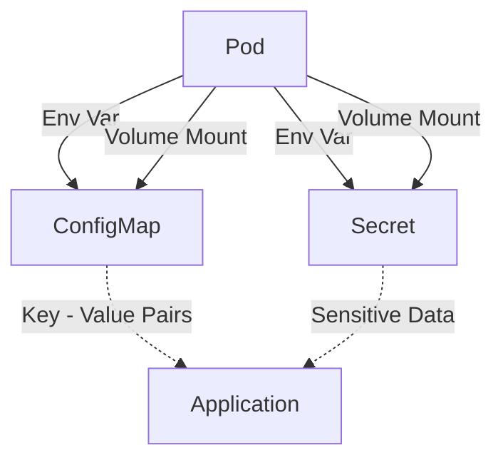

"ConfigMaps and Secrets" are essential components in Kubernetes for managing configuration data and sensitive
information, respectively. They allow your applications to be more dynamic and secure by externalizing the configuration
from the application images. This section explains how ConfigMaps and Secrets work, how to use them, and provides code
examples along with a mermaid illustration to visualize their relationship with Pods.

# 1. ConfigMaps

ConfigMaps allow you to decouple configuration artifacts from image content to keep containerized applications portable.
They are used to store non-sensitive data in key-value pairs.

# Example Manifest for a ConfigMap

```yaml
apiVersion: v1
kind: ConfigMap
metadata:
  name: app-config
data:
  # Configuration values can be set as key-value pairs.
  database_url: "jdbc:mysql://mydatabase.example.com:3306/dbname"
  database_user: "user"
```

# 2. Secrets

Secrets are used to store and manage sensitive information such as passwords, OAuth tokens, and ssh keys, offering a
more secure option than putting them directly into the Pod definition or in a Docker image.

# Example Manifest for a Secret

```yaml
apiVersion: v1
kind: Secret
metadata:
  name: db-secret
type: Opaque
data:
  # The values are base64 encoded
  password: cGFzc3dvcmQ= # "password" base64 encoded
  api_key: S2V5VmFsdWU=   # "KeyValue" base64 encoded
```

# 3. Using ConfigMaps and Secrets in Pods

Both ConfigMaps and Secrets can be used in Pods either as environment variables or as files in a volume.

# Environment Variables

```yaml
apiVersion: v1
kind: Pod
metadata:
  name: mypod
spec:
  containers:
    - name: mypod
      image: myimage
      env:
        - name: DATABASE_URL
          valueFrom:
            configMapKeyRef:
              name: app-config
              key: database_url
        - name: DATABASE_PASSWORD
          valueFrom:
            secretKeyRef:
              name: db-secret
              key: password
```

# Volume Mounts

```yaml
apiVersion: v1
kind: Pod
metadata:
  name: mypod
spec:
  containers:
    - name: mycontainer
      image: myimage
      volumeMounts:
        - name: config-volume
          mountPath: /etc/config
        - name: secret-volume
          mountPath: /etc/secret
  volumes:
    - name: config-volume
      configMap:
        name: app-config
    - name: secret-volume
      secret:
        secretName: db-secret
```

# 4. Best Practices

- **Security for Secrets:** Use RBAC to limit access to Secrets and enable encryption at rest for cluster data.
- **Managing Configuration Changes:** Use immutable ConfigMaps and Secrets for critical applications to avoid unexpected
  changes.

---

The following diagram illustrates how Pods can utilize ConfigMaps and Secrets through environment variables and volume
mounts.



ConfigMaps and Secrets are pivotal for managing application data and sensitive information in Kubernetes, enabling
secure and flexible application configurations. By leveraging these components effectively, you can enhance the security
and portability of your applications within Kubernetes.