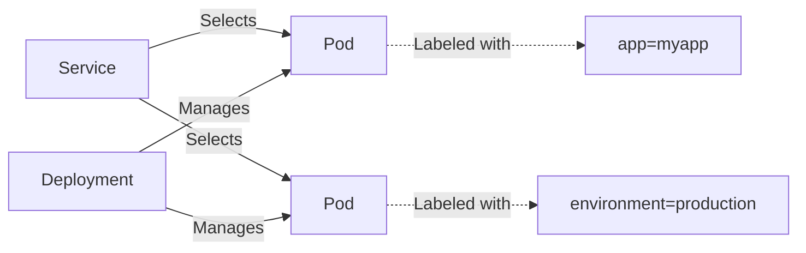
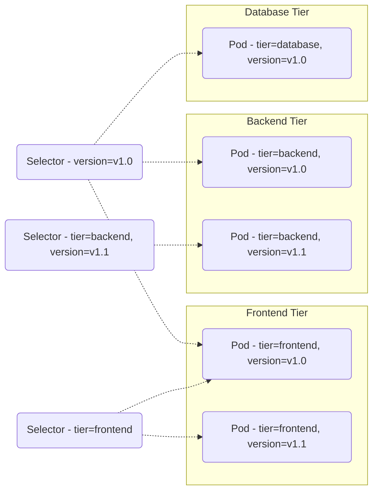

Labels and Selectors are fundamental concepts in Kubernetes that facilitate the organization, management, and selection
of resources within a cluster. By tagging resources with labels and querying them with selectors, you can efficiently
manage and control various aspects of your infrastructure. This section explores how labels and selectors work, their
syntax, and provides practical examples and a mermaid illustration to visualize their application.

# 1. Introduction to Labels

Labels are key/value pairs attached to objects, such as Pods and Services, that are used to organize and select subsets
of objects.

# Definition and Syntax

- Labels are key/value pairs. For example: `environment: production`, `app: nginx`.
- Attached directly to the metadata of Kubernetes objects.

# Example of Labeling

```yaml
apiVersion: v1
kind: Pod
metadata:
  name: my-pod
  labels:
    app: myapp
    environment: production
spec:
  containers:
    - name: nginx-container
      image: nginx
```

# 2. Understanding Selectors

Selectors are used to filter resources based on their labels.

# Selector Types

- **Equality-based selectors:** Allow filtering by label keys and values. For example, `environment=production`.
- **Set-based selectors:** Allow filtering keys according to a set of values. For
  example, `environment in (production, qa)`.

# Example of Using Selectors

To list all Pods in `production`:

```shell
kubectl get pods -l environment=production
```

# 3. Labels and Selectors in Action

Labels and selectors are used together to connect resources and manage deployments efficiently.

# Connecting Services to Pods

```yaml
apiVersion: v1
kind: Service
metadata:
  name: my-service
spec:
  selector:
    app: myapp
  ports:
    - protocol: TCP
      port: 80
      targetPort: 9376
```

# Managing Deployments

```yaml
apiVersion: apps/v1
kind: Deployment
metadata:
  name: my-deployment
spec:
  replicas: 3
  selector:
    matchLabels:
      app: myapp
  template:
    metadata:
      labels:
        app: myapp
    spec:
      containers:
        - name: myapp-container
          image: myapp:1.0.0
```

# 4. Best Practices for Using Labels

- **Strategies for Labeling:** Use consistent and meaningful labels that reflect your deployment's architecture and
  lifecycle.
- **Avoiding Common Pitfalls:** Do not overload labels with too many meanings or use them to store large amounts of
  dynamic data.

---

## Visualizing the Relationship



Labels and Selectors are powerful tools in Kubernetes, offering a flexible way to organize, manage, and select resources
based on custom criteria. By understanding and utilizing these concepts, you can greatly enhance the manageability and
scalability of your Kubernetes resources.

---

## Organizing Resources with Labels and Selectors

Let's visualize the use of labels and selectors with a simplified diagram showing a multi-tier application deployment:



In this diagram:

- **Selectors** are used to target Pods based on their **labels**.
    - `Selector - tier=frontend` selects all frontend Pods, regardless of their version.
    - `Selector - version=v1.0` selects all Pods across tiers that are labeled with `version=v1.0`.
    - A compound selector (`tier=backend, version=v1.1`) selects Pods that match both conditions—here, only the backend
      Pod with `version=v1.1`.

Labels and Selectors enable a powerful, flexible mechanism for organizing and managing Kubernetes resources. By tagging
resources with meaningful labels and using selectors to query these labels, users can efficiently manage complex
environments and deployments within Kubernetes.