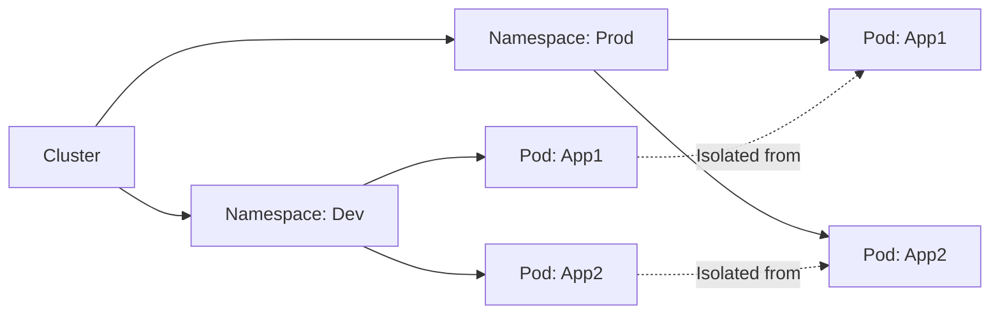

Namespaces in Kubernetes provide a mechanism for isolating groups of resources within a single cluster. This concept is
crucial for managing multiple environments, applications, or teams within the same cluster by segmenting it into virtual
sub-clusters. This section will explain the purpose of namespaces, how they work, and offer practical guidance on their
usage, including examples and a mermaid diagram to illustrate their role in cluster segmentation.

# 1. Introduction to Namespaces

Namespaces are intended for use in environments with many users spread across multiple teams or projects. They provide a
scope for names, allowing the same physical cluster to appear as multiple virtual clusters to different users.

## Purpose and Benefits

- **Isolation:** Keep resources separate to avoid conflicts between teams or projects.
- **Organization:** Simplify resource management and access control.
- **Quota Management:** Apply different resource limits to each namespace to ensure fair use.

## Default Namespaces

- **default:** The default namespace for objects with no other namespace.
- **kube-system:** Contains objects created by the Kubernetes system.
- **kube-public:** This namespace is created automatically and is readable by all users (including non-authenticated
  ones).

# 2. Creating and Managing Namespaces

You can create and manage Kubernetes namespaces using `kubectl`, the Kubernetes command-line tool.

## Example of Creating a Namespace

```yaml
apiVersion: v1
kind: Namespace
metadata:
  name: my-namespace
```

To apply this manifest:

```shell
kubectl apply -f namespace.yaml
```

## Listing and Selecting Namespaces

To list all namespaces:

```shell
kubectl get namespaces
```

To select resources within a specific namespace:

```shell
kubectl get pods --namespace=my-namespace
```

# 3. Namespaces in Action

## Resource Isolation

Namespaces provide a logical division of resources within a Kubernetes cluster, ensuring that teams or projects do not
interfere with each other.

## Access and Quotas

- **Access Control:** You can use Kubernetes Role-Based Access Control (RBAC) to define permissions within each
  namespace.
- **Resource Quotas:** Admins can apply quotas to each namespace, controlling the amount of compute resources a
  namespace can consume.

# 4. Best Practices for Using Namespaces

- **Naming Conventions:** Adopt a consistent naming convention for namespaces to reflect their purpose, such as team
  names, project names, or stages (e.g., `dev`, `staging`, `prod`).
- **When to Use Multiple Namespaces:** Use namespaces to separate environments or teams with different access controls
  or resource requirements.

---

This diagram illustrates how namespaces segment a cluster into logical sections, each containing its resources.



Namespaces are a fundamental aspect of Kubernetes architecture, providing essential mechanisms for resource isolation,
access control, and management. By effectively utilizing namespaces, you can enhance the organization, security, and
efficiency of your Kubernetes cluster.
