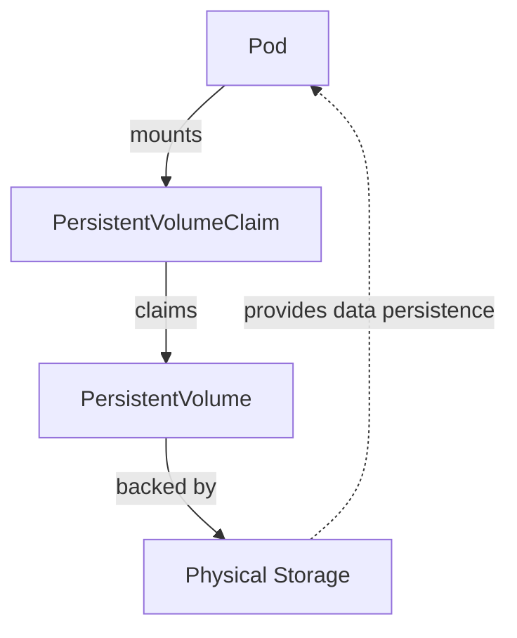

Volumes in Kubernetes are an essential feature, enabling containers to access storage systems and manage data
persistently across container restarts and pod rescheduling. This aspect of Kubernetes is crucial for stateful
applications that require data persistence beyond the lifecycle of individual pods. This section will cover the basics
of Kubernetes volumes, their types, how they work, practical examples, and a mermaid diagram to visualize the concept of
persistent data management in a Kubernetes environment.

# 1. Introduction to Volumes

Volumes in Kubernetes allow data to persist and be shared among containers within a pod, outliving the lifecycle of
individual containers.

# Purpose and Overview

- **Data Persistence:** Ensure important data survives pod restarts and failures.
- **Sharing Data:** Enable containers within a pod to share data easily.

# Volume Lifecycles

- Tied to the lifecycle of the Pod. When a Pod ceases to exist, non-persistent volumes are also removed.

# 2. Types of Volumes

Kubernetes supports several volume types, each designed for specific needs and environments.

- **EmptyDir:** A temporary volume that shares a pod's lifecycle, useful for sharing files between containers in the
  same pod.
- **HostPath:** Used for mounting a file or directory from the host node's filesystem into a pod.
- **PersistentVolume (PV) and PersistentVolumeClaim (PVC):** Provide a way to use durable storage systems that outlive
  pod lifecycles.
- **Cloud Storage Volumes:** Such as AWS EBS, Google Persistent Disk, or Azure Disk, are used for integrating with cloud
  provider-specific storage solutions.

# 3. Persistent Volumes and Claims

PVs and PVCs decouple the storage configuration from the usage of the storage and allow for a more flexible and managed
storage solution.

# Example Manifest for a PersistentVolume

```yaml
apiVersion: v1
kind: PersistentVolume
metadata:
  name: mypv
spec:
  capacity:
    storage: 10Gi
  accessModes:
    - ReadWriteOnce
  persistentVolumeReclaimPolicy: Retain
  storageClassName: standard
  hostPath:
    path: "/mnt/data"
```

# Example Manifest for a PersistentVolumeClaim

```yaml
apiVersion: v1
kind: PersistentVolumeClaim
metadata:
  name: mypvc
spec:
  accessModes:
    - ReadWriteOnce
  resources:
    requests:
      storage: 10Gi
```

# 4. Using Volumes in Pods

Volumes are declared in a Pod's specification and then mounted into containers within that Pod.

# Example Pod Manifest with Volume Mount

```yaml
apiVersion: v1
kind: Pod
metadata:
  name: mypod
spec:
  containers:
    - name: mycontainer
      image: nginx
      volumeMounts:
        - name: mypd
          mountPath: "/var/www/html"
  volumes:
    - name: mypd
      persistentVolumeClaim:
        claimName: mypvc
```

# 5. Best Practices for Managing Data

- **Data Backup and Recovery:** Regularly back up persistent data to prevent data loss.
- **Security Considerations:** Use encrypted volumes and secure access to sensitive data.

---



Volumes in Kubernetes offer flexible solutions for managing persistent data, essential for stateful applications. By
understanding and effectively using Kubernetes volumes, developers can ensure their applications are robust, scalable,
and capable of handling complex data persistence requirements.