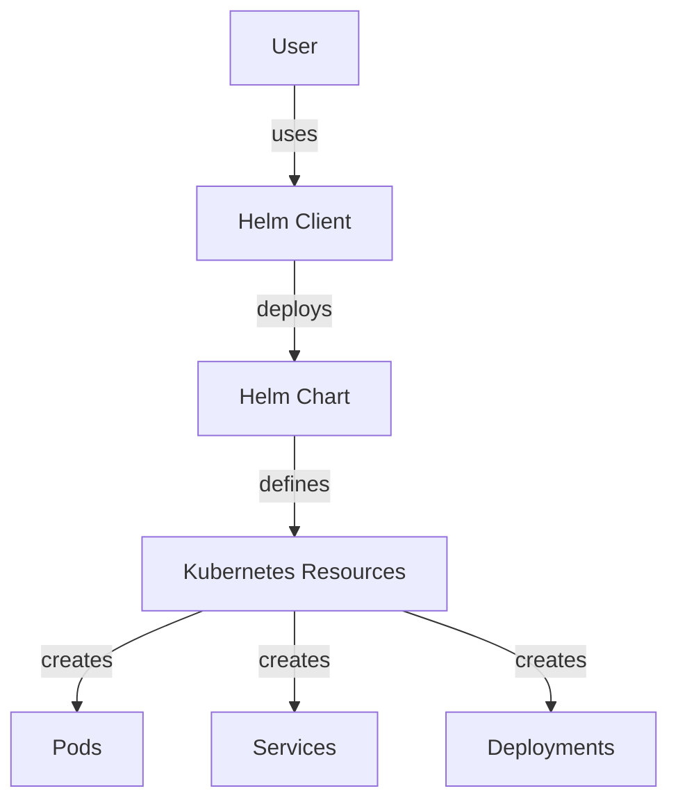

Helm is a powerful tool for managing Kubernetes applications. Helm streamlines installing and managing Kubernetes
applications with packages called charts. Helm charts are comprehensive enough to capture all dependencies and
deployment specifics in a single package, making it an indispensable tool for Kubernetes deployments. This section
covers the basics of Helm, its architecture, benefits, and includes practical examples and a mermaid diagram to
visualize how Helm interacts with Kubernetes.

# 1. Introduction to Helm

Helm is known as the Kubernetes package manager, which allows users to define, install, and upgrade even the most
complex Kubernetes application.

## Purpose and Overview

- **Simplification:** Helm simplifies the deployment and management of applications on Kubernetes clusters.
- **Charts:** Helm uses charts, which are packages containing all necessary resources and configurations to deploy an
  application or service on Kubernetes.

# 2. Helm Architecture

The architecture of Helm has evolved from v2 to v3, with significant improvements.

- **Helm Client:** The command-line client for end-users to interact with Helm charts.
- **Tiller (Helm v2):** The server-side component that Helm used to manage Kubernetes resources. It has been removed in
  Helm v3 for a more secure and simplified client-only model.

# 3. Benefits of Using Helm

Helm offers several advantages for managing applications in Kubernetes environments.

- **Simplified Application Management:** Helm charts describe a complete set of Kubernetes resources needed for an
  application’s deployment.
- **Dependency Management:** Charts can define dependencies on other charts.
- **Easy Configuration and Upgrades:** Customize deployments through chart values and easily roll back to previous
  versions if necessary.

# 4. Getting Started with Helm

Getting started with Helm involves installing the Helm client and using it to deploy applications through charts.

## Installing Helm

Installation instructions vary by operating system but generally involve downloading a release package and moving the
Helm binary to a directory in your `PATH`.

## Deploying a Chart

To deploy an application using Helm, you first need to find a chart for that application, which can often be found in
Helm’s official charts repository or through community repositories.

# 5. Example: Deploying an Application with Helm

## Finding a Chart

```shell
helm repo add stable https://charts.helm.sh/stable
helm search repo stable/nginx
```

## Customizing and Installing a Chart

```shell
helm install my-nginx stable/nginx --values custom_values.yaml
```

---



Helm is a critical tool in the Kubernetes ecosystem, providing an efficient and standardized way to deploy, manage, and
scale applications. By leveraging Helm charts, developers and operations teams can reduce complexity and increase
productivity when working with Kubernetes applications.