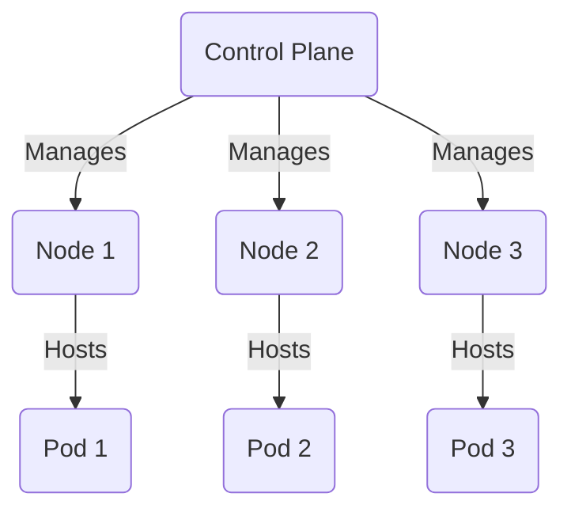
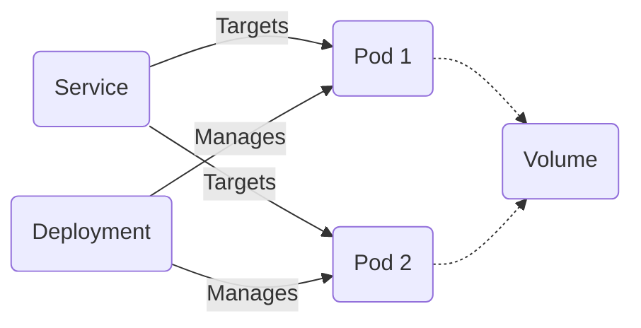

# Core Components of Kubernetes

Kubernetes is an open-source platform designed to automate deploying, scaling, and operating application containers. At
its heart, Kubernetes provides a framework for running distributed systems resiliently. It takes care of scaling and
failover for your application, provides deployment patterns, and more.

Here's an overview of its core components:

1. **Control Plane (Master Node)**: The control plane's components make global decisions about the cluster (for example,
   scheduling), as well as detecting and responding to cluster events (for example, starting up a new pod when a
   deployment's replicas field is unsatisfied).

2. **Nodes (Worker Nodes)**: Nodes are the workers that run applications. Every node in the cluster must run the
   container runtime (such as Docker), and the components necessary to communicate with the control plane. Nodes are
   managed by the control plane.

3. **Pods**: The smallest deployable units created and managed by Kubernetes, a Pod is a group of one or more
   containers, with shared storage and network resources, and a specification for how to run the containers.

4. **Services**: An abstract way to expose an application running on a set of Pods as a network service.

5. **Deployments**: Provides declarative updates to applications. A Deployment allows you to describe an application’s
   life cycle, such as which images to use for the app, the number of pods, and the way to update them, among other
   aspects.

6. **Volumes**: Provides an abstraction that allows data to persist and to be shared among containers in a Pod.

7. **Namespace**: Kubernetes supports multiple virtual clusters backed by the same physical cluster. These virtual
   clusters are called namespaces.

Let's visualize the interaction between these components with Mermaid diagrams.

## Control Plane and Nodes Interaction

## Pods, Services, and Deployments Interaction

These diagrams provide a simplified view of how the core components of Kubernetes interact. Understanding these
interactions is crucial for anyone looking to deepen their knowledge of Kubernetes. Each component plays a critical role
in ensuring applications run smoothly in a distributed environment.
