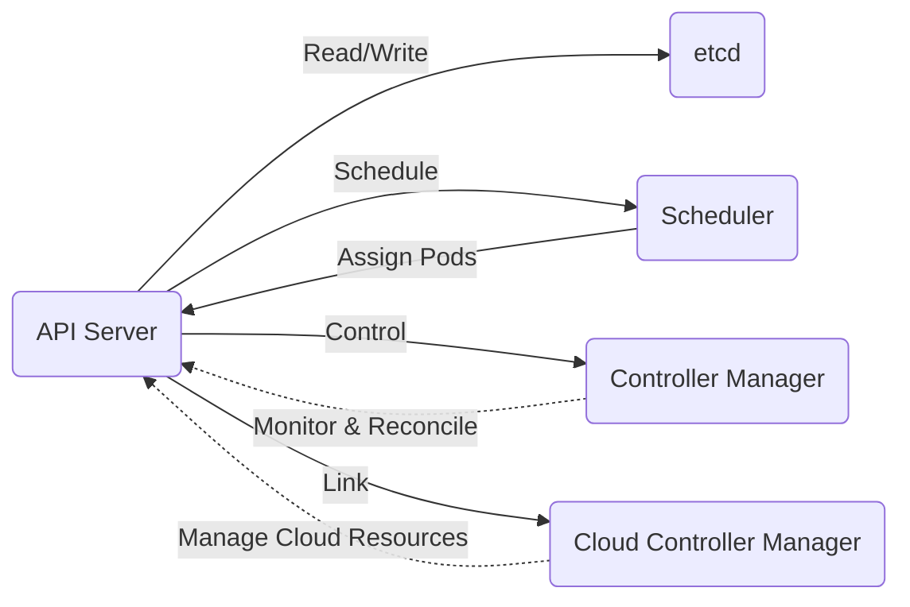

# Master Components: Orchestrating the Orchestra

1. **API Server (`kube-apiserver`)**: The front-end of the control plane, serving as the main management point of the entire cluster. It acts as a gateway through which both internal and external components communicate with the cluster.

2. **etcd**: A highly available key-value store used as Kubernetes' backing store for all cluster data. It stores the entire configuration and state of the cluster, making it the source of truth for the cluster.

3. **Scheduler (`kube-scheduler`)**: Responsible for scheduling pods to run on nodes based on various criteria such as resource requirements, hardware/software/policy constraints, and more.

4. **Controller Manager (`kube-controller-manager`)**: Runs controller processes, which are background threads that handle routine tasks in the cluster. Examples include the Node Controller, Job Controller, and Endpoints Controller.

5. **Cloud Controller Manager (`cloud-controller-manager`)**: Allows you to link your cluster into your cloud provider's API, letting it manage resources such as load balancers and storage buckets on behalf of your pods.

Let's visualize how these components interact within the Control Plane to manage the Kubernetes cluster:

In this diagram, we see the pivotal role of the API Server as the communication hub. It interacts with etcd to store and retrieve cluster state and configuration. The Scheduler decides which node an unscheduled pod will run on. The Controller Manager oversees various controllers that perform background tasks. The Cloud Controller Manager integrates the cluster with cloud-specific features.

Understanding these components and their interactions is crucial for anyone looking to manage or troubleshoot a Kubernetes cluster. They work in concert to ensure the cluster remains in the desired state and efficiently manages the workloads.

This deep dive into the Control Plane reveals the sophistication and power of Kubernetes. It's designed to handle complex, distributed systems at scale, ensuring resilience and efficiency. As you grow more familiar with these components, you'll gain a deeper appreciation for the orchestration and automation capabilities of Kubernetes.