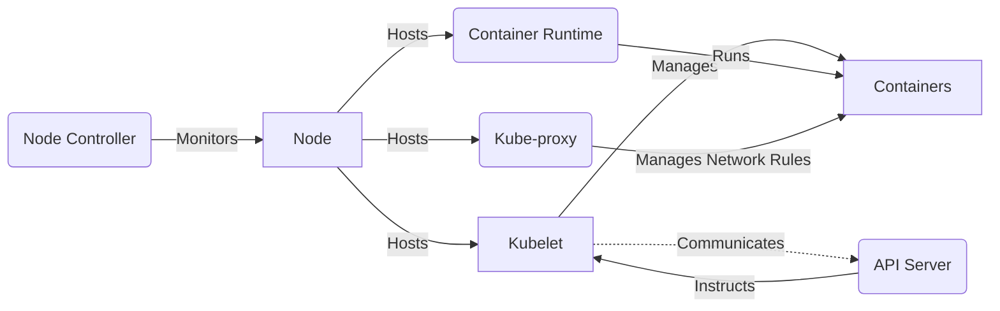

# Node Components: The Workhorses

1. **Kubelet (`kubelet`)**: This is the primary node agent running on each node. The kubelet works in terms of a
   PodSpec. It ensures that the containers described in those PodSpecs are running and healthy. The kubelet doesn't
   manage containers that were not created by Kubernetes.

2. **Container Runtime**: The software responsible for running containers. Kubernetes supports several container
   runtimes: Docker, containerd, CRI-O, and any implementation of the Kubernetes CRI (Container Runtime Interface).

3. **Kube-proxy (`kube-proxy`)**: Kube-proxy is a network proxy that runs on each node in the cluster, implementing part
   of the Kubernetes Service concept. It maintains network rules on nodes. These network rules allow network
   communication to your Pods from network sessions inside or outside of your cluster.

4. **Node Controller**: A control plane component that manages various aspects of nodes, such as tracking and responding
   to when nodes go down. It is part of the kube-controller-manager.

To illustrate how these node components interact with each other and with the Control Plane, let's use a Mermaid
diagram:

In this diagram:

- The **Kubelet** interacts with the **Container Runtime** to run containers based on PodSpecs and maintains
  communication with the **API Server** to receive commands and report back the state of the containers.
- **Kube-proxy** manages network rules that allow communication to and from containers.
- The **Node Controller** monitors the status of nodes and communicates with the **API Server**.

These components work together to ensure that applications run reliably and are able to communicate with each other
across the cluster. The kubelet ensures that the container runtime runs all the containers defined in PodSpecs.
Kube-proxy manages the networking rules to allow network traffic to the pods across the cluster. The smooth operation of
these components is crucial for the health and efficiency of a Kubernetes cluster.

Understanding node components provides insight into the daily operations within a Kubernetes cluster, highlighting the
importance of each component in ensuring that workloads are running as expected.