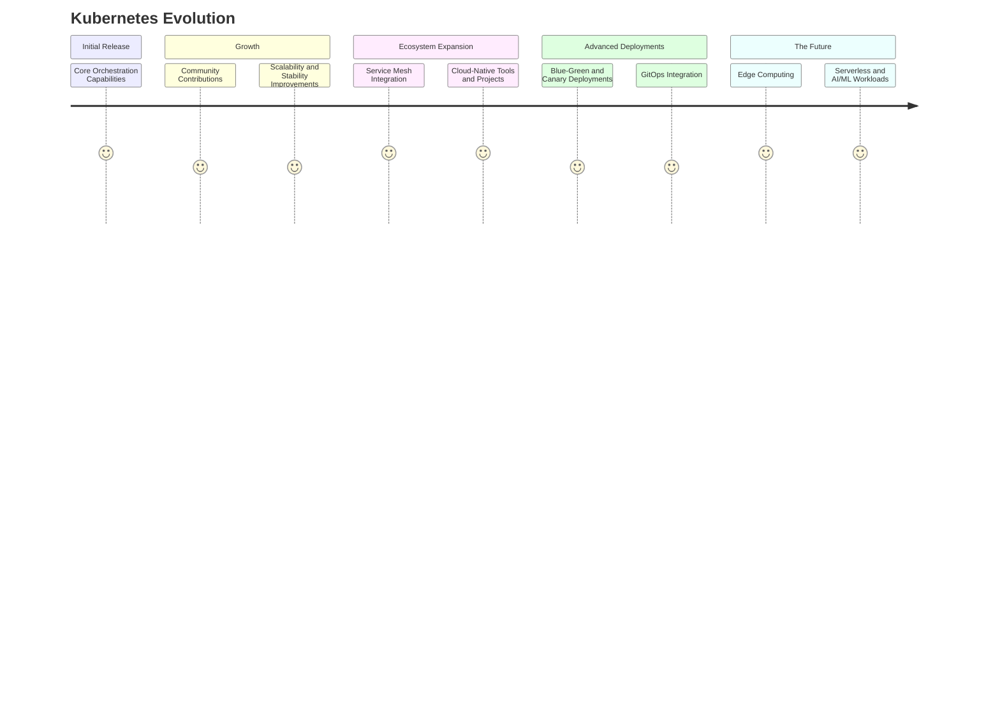

Kubernetes has rapidly evolved from a simple container orchestration tool to a comprehensive cloud-native platform that
supports complex deployments and operations. This evolution reflects the growing needs of businesses to manage their
applications in a highly scalable, resilient, and efficient manner. Let's explore the journey of Kubernetes from its
basic functionalities to advanced deployment strategies, highlighting how it has transformed the landscape of cloud
computing and DevOps.

# The Early Days: Basic Orchestration

- **Initial Release**: Kubernetes was released by Google in 2014, building on a decade of experience running production
  workloads at scale using a system called Borg. The primary aim was to automate the deployment, scaling, and management
  of containerized applications.
- **Core Features**: Early versions focused on the core orchestration capabilities, such as scheduling pods, service
  discovery, load balancing, and basic scaling.

# Growing Up: Stability and Scalability

- **Community Growth**: As the Kubernetes community grew, so did the platform's capabilities. Contributions from across
  the tech industry introduced new features and improvements.
- **Scalability Enhancements**: Kubernetes enhanced its scheduler and introduced features like Horizontal Pod
  Autoscaler (HPA) and Cluster Autoscaler to better manage resource allocation and application scaling.
- **Stability and Reliability**: Efforts were made to ensure Kubernetes could run not just stateless applications but
  also stateful ones with features like StatefulSets.

# Expansion: Ecosystem and Tooling

- **Service Mesh Integration**: Tools like Istio and Linkerd became popular for managing service-to-service
  communication within Kubernetes, offering capabilities like traffic management, security, and observability.
- **Cloud-Native Landscape**: The Cloud Native Computing Foundation (CNCF) adopted Kubernetes, leading to the
  development of an entire ecosystem of cloud-native tools and projects that complement Kubernetes, such as Prometheus
  for monitoring and Helm for package management.

# Advanced Deployment Strategies

- **Blue-Green Deployments**: Kubernetes started supporting advanced deployment strategies like blue-green deployments,
  enabling zero-downtime updates by switching traffic between two identical environments running different versions of
  an application.
- **Canary Deployments**: Canary deployments were facilitated by gradually routing a small portion of the traffic to new
  versions of the application, allowing teams to test in production without impacting all users.
- **GitOps**: The adoption of GitOps practices, where Git repositories serve as the source of truth for declarative
  infrastructure and applications, integrating well with Kubernetes for automated syncing of desired state
  configurations.

# The Future: Kubernetes Everywhere

- **Edge Computing**: Kubernetes is extending beyond the data center into edge locations, managing workloads close to
  users for reduced latency and improved experiences.
- **Serverless and FaaS**: Integration with serverless frameworks and Function as a Service (FaaS) platforms, enabling
  more efficient resource use and event-driven architectures.
- **AI and Machine Learning Workloads**: Enhanced support for AI/ML workloads, leveraging Kubernetes for scalable
  training and inference jobs.

# Mermaid Diagram: Evolution Timeline

Let's depict the Kubernetes evolution timeline with a simplified Mermaid diagram:

The evolution of Kubernetes is a testament to the power of open-source collaboration and innovation. From basic
orchestration to advanced deployment strategies and beyond, Kubernetes continues to adapt and evolve, meeting the
ever-changing demands of the technology landscape. This journey underscores Kubernetes' role as a foundational element
of modern cloud-native architectures, enabling businesses to deploy and manage applications at unprecedented scale and
speed.