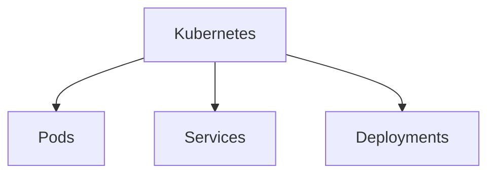
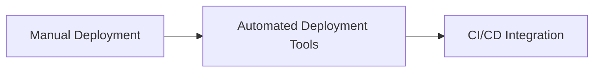
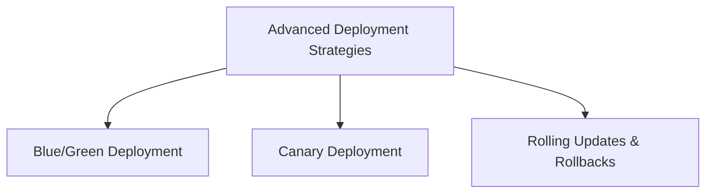
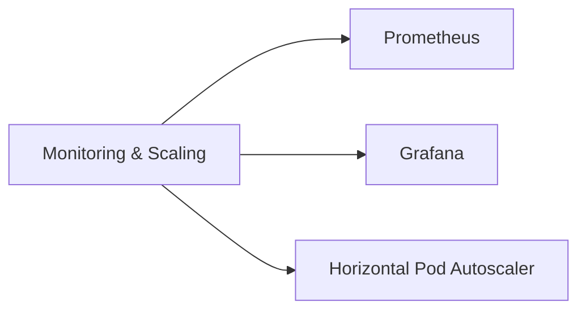
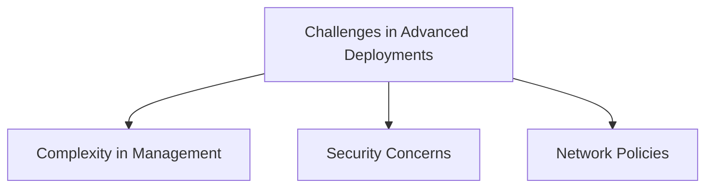

# Outline

1. **Introduction to Kubernetes**
   - What is Kubernetes?
   - Core Concepts: Pods, Services, Deployments

2. **Evolution of Kubernetes Deployment**
   - Manual Deployment
   - Automated Deployment Tools
   - CI/CD Integration

3. **Advanced Deployment Strategies**
   - Blue/Green Deployment
   - Canary Deployment
   - Rolling Updates and Rollbacks

4. **Monitoring and Scaling**
   - Horizontal Pod Autoscaler
   - Cluster Monitoring with Prometheus and Grafana

5. **Challenges in Advanced Deployments**
   - Complexity in Management
   - Security Concerns
   - Network Policies

# 1. Introduction to Kubernetes

Kubernetes is an open-source platform designed to automate deploying, scaling, and operating application containers. It groups containers that make up an application into logical units for easy management and discovery.

- **Pods:** The smallest deployable units created and managed by Kubernetes.
- **Services:** An abstract way to expose an application running on a set of Pods as a network service.
- **Deployments:** Manage the deployment and scaling of a set of Pods and provide updates to applications.

# 2. Evolution of Kubernetes Deployment

Initially, deployments were managed manually, which was time-consuming and error-prone. Over time, tools like Helm and Kustomize automated this process, integrating with Continuous Integration and Continuous Deployment (CI/CD) systems for streamlined workflows.

# 3. Advanced Deployment Strategies

Advanced strategies like Blue/Green deployments, Canary releases, and Rolling updates help in minimizing downtime and risk by gradually shifting traffic to new versions of the application.

- **Blue/Green Deployment:** Two identical environments switch traffic from blue (old) to green (new) once the new version is ready.
- **Canary Deployment:** Releases the new version to a small subset of users before rolling it out to everyone.
- **Rolling Updates and Rollbacks:** Gradually replaces instances of the old version with the new version, with the ability to rollback.

# 4. Monitoring and Scaling

Monitoring tools like Prometheus and Grafana offer insights into applications and infrastructure. The Horizontal Pod Autoscaler automatically scales the number of Pods in a replication controller, deployment, or stateful set based on observed CPU utilization or other selected metrics.

# 5. Challenges in Advanced Deployments

As deployments grow more complex, they introduce challenges in management, security, and networking. Understanding and mitigating these challenges is crucial for maintaining a healthy and secure Kubernetes environment.

This lesson provides a comprehensive overview of the evolution of Kubernetes deployments, from basic concepts to advanced strategies and challenges. Each section delves into critical aspects of Kubernetes, supported by graphical representations to aid in understanding. With this knowledge, learners can appreciate the depth and breadth of Kubernetes deployments, preparing them for further exploration and mastery of this essential cloud-native technology.
